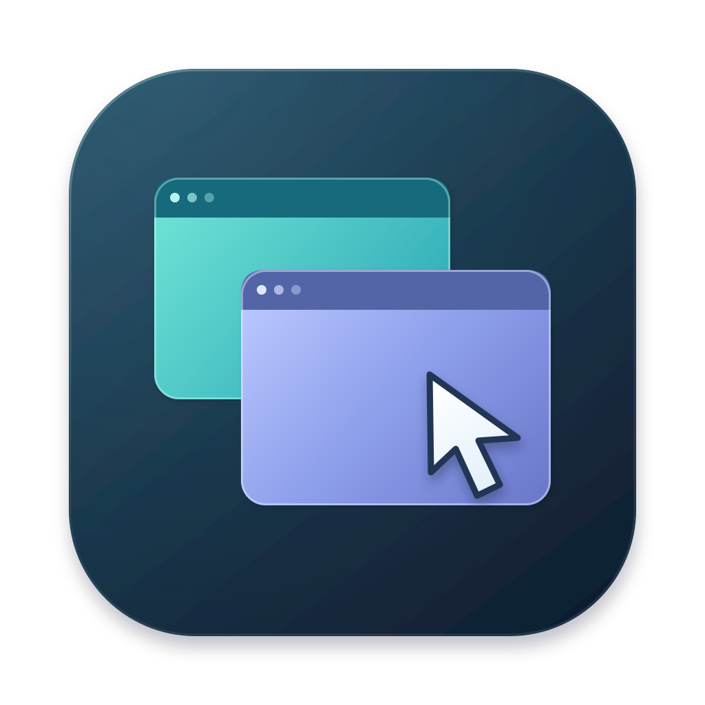

# RV



A native desktop VNC viewer written in Rust with [GPUI](https://www.gpui.rs/). Direct RFB (RFC 6143) connections, address-book chrome, and a session toolbar inspired by RealVNC Classic Viewer / Connect Viewer — original branding, not a RealVNC product.

## Features

- Address book with search, labels, list/grid views, desktop previews, and recents
- Light / dark / system appearance
- Session window with pinned or auto-hide toolbar, F8 menu, and connection info
- Fit / 1:1 (scrollable) / stretch scaling and full screen
- Mouse (left/middle/right, vertical + horizontal wheel), keyboard, Ctrl+Alt+Del and extra keys (Ctrl/Alt/Win/Tab/Esc/Caps — Caps toggles the remote caps-lock)
- Reconnect from the disconnect / error overlay
- Clipboard sync (Latin-1, per RFB)
- VNC Auth, Tight / ZRLE / TRLE / Raw encodings
- VeNCrypt TLS: `TLSVnc` / `TLSNone` (anonymous TLS, TigerVNC's default) via OpenSSL, `X509Vnc` / `X509None` via rustls with WebPKI roots. `Let server choose` picks encryption automatically when the server offers nothing else
- Passwords stored in the OS keychain
- Touch ID for saved passwords in signed macOS builds (with macOS password fallback)

## Build

```bash
cargo run -p rv-app --release
```

Connect to a local server such as TigerVNC, TightVNC, x11vnc, QEMU, or `rustvncserver` on `127.0.0.1:5900`, or pass a target on the command line:

```bash
rv 10.0.0.8          # port 5900
rv pi.local:1        # display 1 → port 5901 (numbers below 100 are displays)
rv pi.local::5901    # explicit port
rv [2001:db8::1]:2   # IPv6
```

## Keyboard shortcuts

| Address book | | Session | |
| --- | --- | --- | --- |
| ⌘N | New connection | F8 | Session menu |
| ⌘F | Search | ⇧⌘F | Full screen |
| ⌘L | Toggle list / grid | ⌘W | Close window |
| ⌘I | Properties | | |
| ⌘D | Duplicate | | |
| ⌘B | Toggle sidebar | | |
| ⌘, | Preferences | | |
| ↩ / ⌫ | Connect / delete selected | | |

Ctrl / Alt / ⌘ are forwarded to the remote desktop while a session has focus.

## Tests

```bash
cargo fmt --all -- --check
cargo clippy --workspace --all-targets --locked -- -D warnings
cargo test --workspace --locked
```

CI runs these checks and builds the app on macOS, Linux, and Windows, each on
x86_64 and ARM64 native runners. It runs for pull requests and pushes to `main`
or `master`, and can also be started manually.

The UI tests render and dispatch keyboard/mouse events through GPUI's test
platform, without native windows, a display server, or a GPU. They use temporary
address books and an in-memory VNC peer, covering form validation and saving,
busy controls, search, keyboard forwarding, pointer mapping, and cursor restoration.
Run just these tests with:

```bash
cargo test -p rv-app --locked offscreen_
```

A mock RFB server for manual testing lives in `crates/rv-session/examples/mock_server.rs`:

```bash
RV_MOCK_SIZE=1280x800 RV_MOCK_RECTS=8 cargo run -p rv-session --example mock_server 127.0.0.1:5999
RV_DATA_DIR=/tmp/rv-scratch cargo run -p rv-app -- 127.0.0.1:5999
```

`RV_DATA_DIR` overrides the address-book location (default: the platform data directory).

## macOS signing and Touch ID

Touch ID-protected passwords require a Developer ID-signed app and a matching macOS
Developer ID provisioning profile for `io.github.madeye.rv`. Package a release build with:

```bash
cargo build --release -p rv-app --locked
python3 scripts/package-macos.py \
  --binary target/release/rv --output target/release/RV.app \
  --identity "$RV_SIGN_IDENTITY" --profile "$RV_PROVISION_PROFILE"
```

The packager embeds the profile, derives the app's Keychain entitlements from it,
and verifies the signature. Omit both signing arguments for an ad-hoc bundle;
ad-hoc builds and plain `cargo run` cannot access protected saved passwords. VNC
connections with **Remember password** turned off still work in those builds.

On first use, existing login-Keychain passwords are copied into the protected
Keychain, then removed from the old store. macOS may request the login password
once to authorize reading an old entry. Later reads use Touch ID when available;
macOS retains its password fallback for unavailable or locked-out biometrics.
Cancelling authentication cancels the connection attempt. Editing connection
settings leaves saved passwords untouched unless a replacement is entered.

For a manual authentication check, run `cargo build -p rv-core --example keychain_roundtrip`,
package `target/debug/examples/keychain_roundtrip` with the
same signing arguments, and run that bundle's `Contents/MacOS/rv` executable. The
check creates, updates, authenticates, and removes a temporary test credential.

## Layout

| Crate | Role |
| --- | --- |
| `rv-core` | Connection models, address book, keysyms, prefs |
| `rv-session` | Tokio RFB session, framebuffer, VeNCrypt |
| `rv-app` | GPUI UI |

macOS is the primary target. Linux and Windows should compile via GPUI.

## License

[MIT](LICENSE) © 2026 Max Lv
