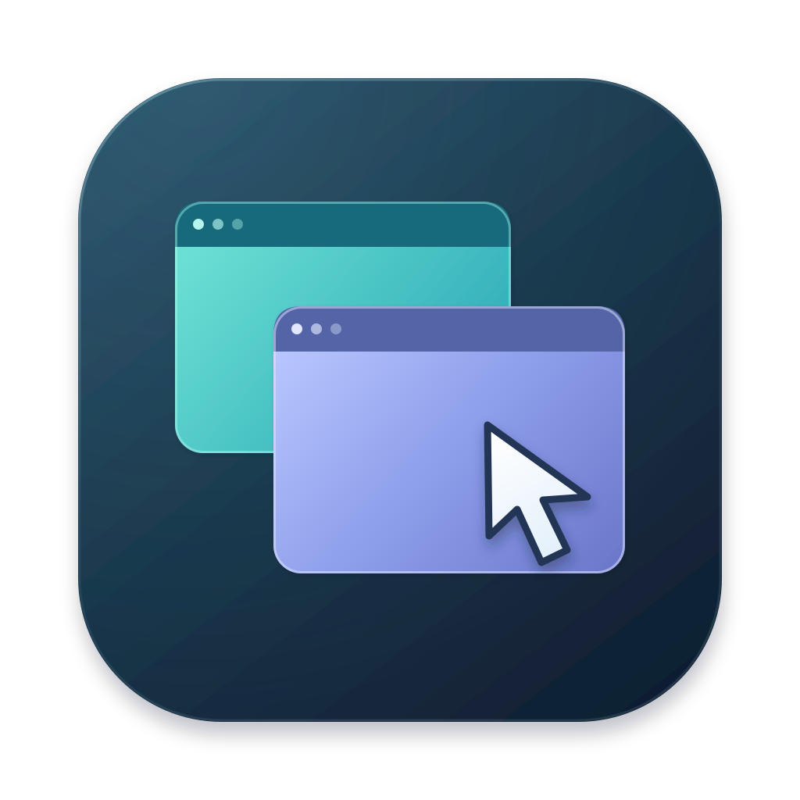

# RV



A native desktop VNC viewer written in Rust with [GPUI](https://www.gpui.rs/). Direct RFB (RFC 6143) connections, address-book chrome, and a session toolbar inspired by RealVNC Classic Viewer / Connect Viewer — original branding, not a RealVNC product.

## Features

- Address book with search, labels, list/grid views, desktop previews, and recents
- Light / dark / system appearance
- Session window with pinned or auto-hide toolbar, F8 menu, and connection info
- Fit / 1:1 (scrollable) / stretch scaling and full screen
- Mouse (left/middle/right, vertical + horizontal wheel), keyboard, Ctrl+Alt+Del and extra keys (Ctrl/Alt/Win/Tab/Esc/Caps — Caps toggles the remote caps-lock)
- Reconnect from the disconnect / error overlay
- Clipboard sync (Latin-1, per RFB)
- VNC Auth, Tight / ZRLE / TRLE / Raw encodings
- Mac Screen Sharing / Apple Remote Desktop (ARD) login using the **Username** and **Password** fields in connection properties. ARD encrypts credentials, but requires no legacy VNC password setting on the Mac. Use **Let server choose**; **Always on** still requires VeNCrypt session TLS.
- VeNCrypt TLS: `TLSVnc` / `TLSNone` (anonymous TLS, TigerVNC's default) via OpenSSL, `X509Vnc` / `X509None` via rustls with WebPKI roots. `Let server choose` picks encryption automatically when the server offers nothing else
- Remembered passwords encrypted in the local application data directory

## Build

```bash
cargo run -p rv-app --release
```

Connect to a local server such as TigerVNC, TightVNC, x11vnc, QEMU, or `rustvncserver` on `127.0.0.1:5900`, or pass a target on the command line:

```bash
rv 10.0.0.8          # port 5900
rv pi.local:1        # display 1 → port 5901 (numbers below 100 are displays)
rv pi.local::5901    # explicit port
rv [2001:db8::1]:2   # IPv6
```

## Keyboard shortcuts

| Address book | | Session | |
| --- | --- | --- | --- |
| ⌘N | New connection | F8 | Session menu |
| ⌘F | Search | ⇧⌘F | Full screen |
| ⌘L | Toggle list / grid | ⌘W | Close window |
| ⌘I | Properties | | |
| ⌘D | Duplicate | | |
| ⌘B | Toggle sidebar | | |
| ⌘, | Preferences | | |
| ↩ / ⌫ | Connect / delete selected | | |

Ctrl / Alt / ⌘ are forwarded to the remote desktop while a session has focus.

## Tests

```bash
cargo fmt --all -- --check
cargo clippy --workspace --all-targets --locked -- -D warnings
cargo test --workspace --locked
```

CI runs these checks and builds the app on macOS, Linux, and Windows, each on
x86_64 and ARM64 native runners. It runs for pull requests and pushes to `main`
or `master`, and can also be started manually.

The UI tests render and dispatch keyboard/mouse events through GPUI's test
platform, without native windows, a display server, or a GPU. They use temporary
address books and an in-memory VNC peer, covering form validation and saving,
busy controls, search, keyboard forwarding, pointer mapping, and cursor restoration.
Run just these tests with:

```bash
cargo test -p rv-app --locked offscreen_
```

A mock RFB server for manual testing lives in `crates/rv-session/examples/mock_server.rs`:

```bash
RV_MOCK_SIZE=1280x800 RV_MOCK_RECTS=8 cargo run -p rv-session --example mock_server 127.0.0.1:5999
RV_DATA_DIR=/tmp/rv-scratch cargo run -p rv-app -- 127.0.0.1:5999
```

`RV_DATA_DIR` overrides the address-book location (default: the platform data directory).

To preview file transfer without an iPhone, start the local TightVNC 1.x fixture
with an existing folder as its remote root:

```bash
mkdir -p /tmp/rv-file-fixture
cargo run -p rv-session --example tight_file_server -- /tmp/rv-file-fixture 127.0.0.1:5999
cargo run -p rv-app -- 127.0.0.1:5999
```

Open the folder button in RV's session toolbar. Select local files and click
**Upload**, or select remote files and click **Download**. Command-click or
Shift-click to select multiple items. Selected files enter a serial transfer
queue with per-item progress, errors, and **Retry**. The queue scrolls when there are many
items and collapses after all queued jobs succeed. Click the Name, Size, or
Modified column heading to sort that pane; no file search is provided.
The arrow button in
the session toolbar opens a native file picker for a single upload. Downloads
are saved in the folder shown on the left. If a destination name exists, choose
**Skip**, **Rename**, or **Replace** before the batch starts. Replacement first
transfers to a temporary name, verifies it, then replaces the original.
Each pane has Back, Up, and an editable path. Right-click a file to copy its
name or path, inspect its details, upload or download it, rename it, or delete it after a
confirmation. Each pane also has a compact **New folder** action. Delete is
permanent, and folders must be empty.
In full screen, hover over the small top-edge handle to reveal **Exit full screen**,
or press Shift-Command-F.
Enable File Transfer in TrollVNC settings and apply the change to offer this extension. The fixture runs
only on localhost and keeps uploads inside the folder passed to it.
TrollVNC 3.2-278 or newer advertises its own file-management capability after
RV requests it. Remote Delete, Rename, and New folder are available only when that
capability is received; older TightVNC servers retain list, upload, and
download. TrollVNC confines management operations to its file-transfer root
and rejects symlink traversal through parent folders.
TrollVNC 3.2-283 adds a negotiated Photos capability. The file-transfer window
switches between filesystem **Files** and the PhotoKit-backed **Photos** list.
The Photos header can filter the list to an iOS photo album; pages show 12
images with compact thumbnails.
**Upload to Photos** stages an image, checks its SHA-256 on the device, imports
it through PhotoKit, and verifies the new asset ID. Remote image context menus
can import an existing file. Imported assets retain their source filenames.
**Download original** exports the selected asset
to a temporary remote file and transfers it through TightVNC. PhotoKit access
requires the TrollVNC RootHide package and a real iOS device.
The Photos context menu labels this action **Download** and offers **Delete…**
when the server advertises photo deletion. Deletion uses PhotoKit, moves the
asset to Recently Deleted, and requires iOS confirmation in the VNC window.
With a server that advertises batch deletion, use Command-click to toggle
photos or Shift-click to select a range on the current page, then choose
**Delete (N)**. Up to 50 selected assets go through one PhotoKit change request.
The protocol implementation currently handles uncompressed TightVNC file lists
and data. Cancelling an in-progress download requires reconnecting before the
next download, because TightVNC's file frames have no transfer identifier.
Uploads are first checked against a fresh remote listing and the expected
size. TrollVNC 3.2-285 also exposes a SHA-256 query; RV checks both uploads and
downloads and reports **SHA-256 verified** only when the digests match. A
mismatched download is removed before local replacement. Older servers can
only confirm file size and the uploaded name. **Sent · unverified** means the final
verification has not completed.

`tests/fixtures/libvncserver_file_fixture.c` is a localhost harness for
checking against LibVNCServer itself. On macOS, with a host build of
LibVNCServer installed:

```bash
LIBVNCSERVER_PREFIX="$(brew --prefix libvncserver)"
clang -I "$LIBVNCSERVER_PREFIX/include" tests/fixtures/libvncserver_file_fixture.c \
  tests/fixtures/photo_library_fake.c ../TrollVNC/src/FileManagement.c \
  -L "$LIBVNCSERVER_PREFIX/lib" -lvncserver -o /tmp/rv-libvncserver-file-fixture
RV_LIBVNCSERVER_FIXTURE=/tmp/rv-libvncserver-file-fixture \
  cargo test -p rv-session tight_file_roundtrip_with_real_libvncserver_when_available
```

This test checks real file listing, download, upload, SHA-256 verification,
atomic replacement, folder creation, rename, deletion, symlink escape rejection, and the Photos
list/import/export protocol with a fake PhotoKit backend
without an iOS device. The archive in `TrollVNC/lib-simulator` targets iOS
Simulator and cannot be linked into a macOS executable.

To test Mac authentication locally:

```sh
RV_MOCK_ARD=1 cargo run -p rv-session --example mock_server 127.0.0.1:5999
```

Connect to `127.0.0.1:5999` with username `test-user` and password `test-password`
(or set `RV_MOCK_USERNAME` / `RV_MOCK_PASSWORD` on the server). The mock offers
`ARD, 33, 36, 35`, decrypts and validates both credentials, and rejects incorrect
logins. ARD mode takes precedence over `RV_MOCK_TLS`. Automated TCP tests cover
accepted/rejected logins, missing credentials, desktop frames, and input after
authentication; malformed DH parameters and credential byte limits have unit tests.

## macOS packaging

Package a release build with:

```bash
cargo build --release -p rv-app --locked
python3 scripts/package-macos.py \
  --binary target/release/rv --output target/release/RV.app
```

Pass `--identity "$RV_SIGN_IDENTITY"` to sign with a Developer ID identity;
without it the bundle is ad-hoc signed. Saved passwords are stored as AES-256-GCM
files in `passwords/` under the RV data directory. Each save uses a random nonce,
but the encryption key is fixed in the executable: anyone with the binary and
password files can recover them. Existing passwords in the OS keychain are not
copied; enter and save each password again after upgrading. Editing connection
settings leaves a saved password untouched unless a replacement is entered.

## Layout

| Crate | Role |
| --- | --- |
| `rv-core` | Connection models, address book, keysyms, prefs |
| `rv-session` | Tokio RFB session, framebuffer, VeNCrypt |
| `rv-app` | GPUI UI |

macOS is the primary target. Linux and Windows should compile via GPUI.

## License

[MIT](LICENSE) © 2026 Max Lv
